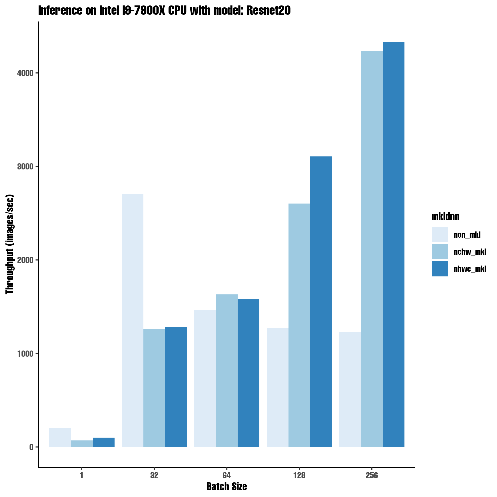

### tensorflow benchmarks on CPU

Tensorflow MKL vs Non-MKL benchmarks on Intel(R) Core(TM) i9-7900X CPU @ 3.30GHz 
Model used:: ResNet50
Essentially to answer questions like, 

- why mkl version is slow vs non mkl version?
  **it depends**

- will mkl version be always fast? 
  **no..**

- what is the ideal batch size?
  **well.. yeah, its a bit of trial and error..in most cases for higher batch size, use MKL-DNN based version**

## how to run?
This benchmarks use conda package manager, I assume you have it installed on your system
Run this in your shell


### let's start with a clean workspace

```zsh
  read "?ARE YOU SURE YOU WANT TO DELETE ./workspace DIRECTORY?"
  rm -rf ./workspace
```
### create a conda environment with non-mkl version of TensorFlow

```zsh
  echo "creating a conda env with non mkl TensorFlow" &&\
    conda env create --file=./no_mkl_environment.yml -q &&\
    conda activate tf-no_mkl
```
### benchmark, collect data and remove the conda environment

```zsh
  ./bench_tf.sh &&\
    conda deactivate &&\
    conda env remove -n tf-no_mkl
```

### create a conda environment with mkl version of TensorFlow

```zsh
  echo "creating a conda env with mkl based TensorFlow" &&\
    conda env create --file=./mkl_environment.yml -q &&\
    conda activate tf-mkl
```

### run benchmark and save data; remove conda env 

```zsh
  ./bench_tf.sh
    conda deactivate &&\
    conda env remove -n tf-mkl
```  
### minimal etl, filter and unify mean throughput for different batches
  
```zsh
  ./etl.sh
```

### plot the data if Rscript is available

```zsh
if test -f $(which Rscript); then
    ./plot.r
  fi
```
### on my local, the results mean inference throughput for ResNet20 looks like:



### clean up, nuke workspace

```zsh
  rm -rf ./workspace/
```
